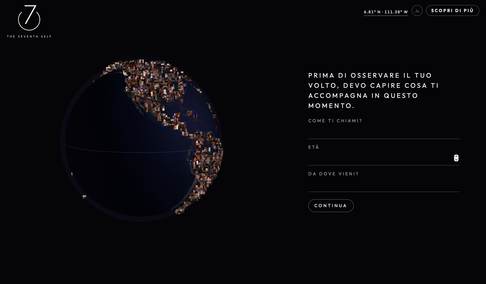
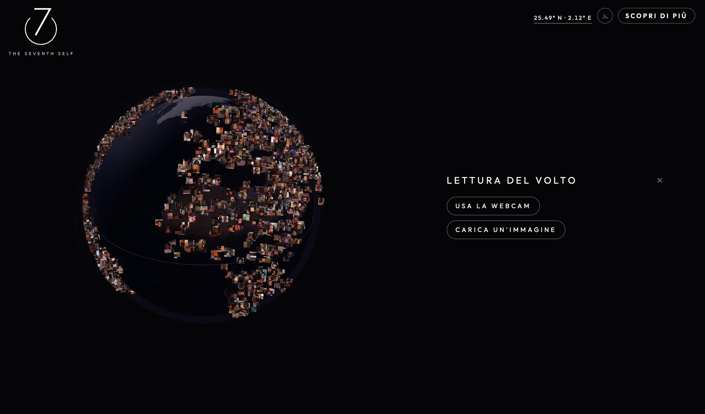
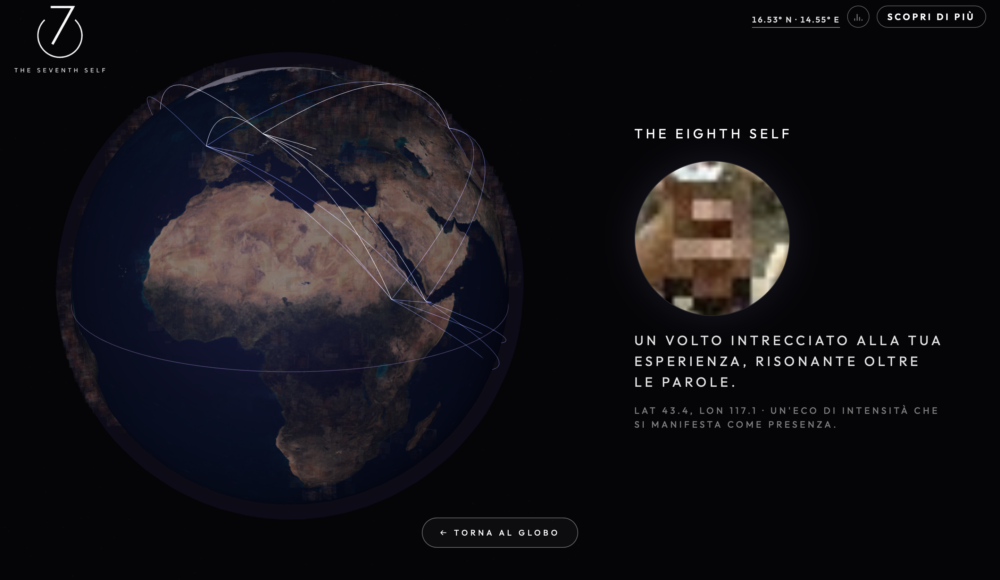

# The Seventh Self: Un osservatorio delle identità invisibili

> **The Seventh Self** è un'esperienza interattiva che esplora l'idea di un sesto senso digitale: la capacità di percepire connessioni che normalmente rimangono invisibili.

Partendo dal mito dei *"sette sosia nel mondo"*, il progetto ne ridefinisce il significato. I sosia qui non sono persone fisicamente identiche, ma individui che condividono qualcosa di più sottile: una traccia emotiva, una tensione interiore, un modo di osservare il mondo, un pattern nascosto che emerge dai dati.

**[Vivi l'esperienza online](https://gciocc.github.io/TheSeventhSelf/)**


## Il Concetto e l'Esperienza
Attraverso un questionario percettivo, l'analisi del volto in tempo reale e una serie di segnali

<p align="center">
  
  
</p>

il sistema costruisce una mappa di affinità. Ricerca così, all'interno di un archivio di migliaia di identità, sette presenze connesse all'utente da relazioni non immediatamente visibili, visualizzandole come una costellazione sul globo terrestre.


Al termine dell'esperienza, le sette identità convergono nella generazione di una nuova figura simbolica: **The Eighth Self** (L'Ottava Risonanza), una possibile versione latente di noi stessi creata dalla fusione delle connessioni emerse.



## Funzionalità Principali

* **Lettura del Volto & Webcam Input:** Analisi dei tratti somatici ed espressivi direttamente tramite feed video in tempo reale.
* **Questionario Dinamico:** Test psicometrico/percettivo composto da 5 domande situazionali per tracciare lo stato emotivo corrente.
* **Mappa Interattiva (Canvas 3D):** Visualizzazione delle 7 risonanze geolocalizzate su un globo, collegate tra loro e rispetto all'utente.
* **Visualizzazione "The Eighth Self":** Algoritmo di sintesi finale per generare la figura latente derivata dalle risonanze.

---

## Tecnologie Utilizzate

Il progetto è sviluppato come un'applicazione web interattiva *client-side*, ottimizzata per le performance grafiche e l'elaborazione dati in locale:

* **Frontend:** HTML5, CSS3, JavaScript (ES6+)
* **Computer Vision / Face Tracking:** *(Face-api.js libreria specifica usata per la lettura del volto)*
* **Grafica & Animazioni:** Canvas API / WebGL *(Three.js per il globo in 3D)*
* **Hosting:** GitHub Pages (deploy automatizzato)

---

## Sviluppo Locale (Come Iniziare)

Poiché l'applicazione richiede l'accesso alla webcam e l'utilizzo di risorse statiche (modelli di face tracking, asset multimediali), è consigliabile eseguirla tramite un server locale.

### Prerequisiti
* [Node.js](https://nodejs.org/) installato (facoltativo, utile per avviare un server locale velocemente).

### Installazione e Avvio

1. **Clona la repository:**
```bash
   git clone [https://github.com/gciocc/TheSeventhSelf.git](https://github.com/gciocc/TheSeventhSelf.git)
   cd TheSeventhSelf

---

### Struttura del Progetto

├── assets/                  # Loghi, immagini di background e asset grafici
├── models/                  # Modelli pre-addestrati per il face tracking
├── js/                      # Logica JavaScript (gestione canvas, webcam, domande)
├── css/                     # Fogli di stile e animazioni dell'interfaccia
├── index.html               # Entry point dell'esperienza interattiva
└── README.md                # Questo file

Autorialità e Crediti
Progetto e autorialità: Giorgia Ciocca — IED (Istituto Europeo di Design)

Contatti: g.ciocca@ied.edu

The Seventh Self non cerca di dirti chi sei. Ti invita a chiederti da quante identità invisibili sei composto.
